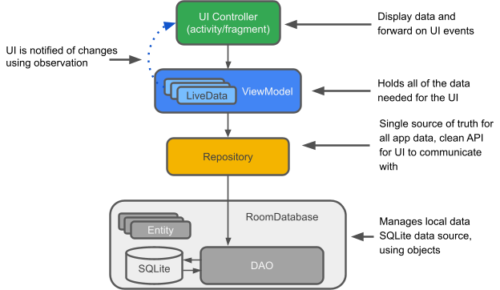

# Developer documentation SLR Toolkit App for Android

## Product description
The SLR Toolkit App is a Toolkit for Systematic Literature Reviews for the Android platform.
The following features are currently supported:
- Initializing a new project by cloning a git repository that contains an SLR Toolkit project
- Pulling, committing and pushing to git repository
- Viewing all publications or filtered by a taxonomy class
- Filtering and deleting publications
- Classifying publications
- Analyzing the current project (bar-chart and bubble-chart)

## Build and run
In Android Studio:
1. Select "app" from the run configurations menu in the toolbar.
2. Select the device that you want to run the app on in the target device menu.
If you don't have any devices configured, you need to either create an Android Virtual Device to use the Android Emulator or connect a physical device.
3. Click "Run".
Tested with Android Studio Giraffe, 2022.3.1.

## Architecture
The architecture followed in this project follows the promoted architectural pattern by Google,
which is the MVVM (Model-View-Viewmodel) alongside the repository architectural pattern.

The diagram shows the relationship between the architecture components.

LiveData: A data holders class which can be observed. The most recent version of the data is always held or cached, and it alerts observers when the data has changed. UI elements don't pause or resume observation. They just keep track of the pertinent data.

ViewModel: It serves as communication center between the UI and the Repository. The source of the data is no longer a concern for the UI. ViewModel instances are preserved during Activity or Fragment recreation.

Repository: A class used to manage various data sources.

Entity: Is an annotated class that describe a database table.

Room database: It provides access to the SQLite database underneath, and it uses the Data access object to send SQLite database queries.

Data access object: This is a function to SQL query mapping.

SQLite database: This is an on device database, that is created and maintained by the Room persistence library.

## Project Structure
The project contains the following directories:
- app/src/main/java/de/davidtiede/slrtookit: contains the activities
  - database: contains everything related to persistence and database entities
  - fragments: contains the fragments
  - repositories: contains the data repositories 
  - util: contains utilities used by the views
  - views: contains all views like adapters and buttons used in the fragments and activities
  - viewmodels: contains the view-models that are used in the fragments and activities
  - worker: contains the workers
- gradle: contains the Gradle Wrapper
- img: contains the images for the README.md

## Dependencies
The project's dependency are managed with Gradle. The following dependencies are used:
- Android Jetpack: Successor to the Android Support Library
- JBibtex: library for parsing bibtex files
- JGit: library used for executing all functions relating git
- JUnit: library for testing
- Material Components for Android: library to help execute Material Design
- MPAndroid Chart: library for visualizing data
- Swipecards: library for swiping cards

## Features which are not implemented
- Solving of merge conflicts
- Writing of the classification to the local repository