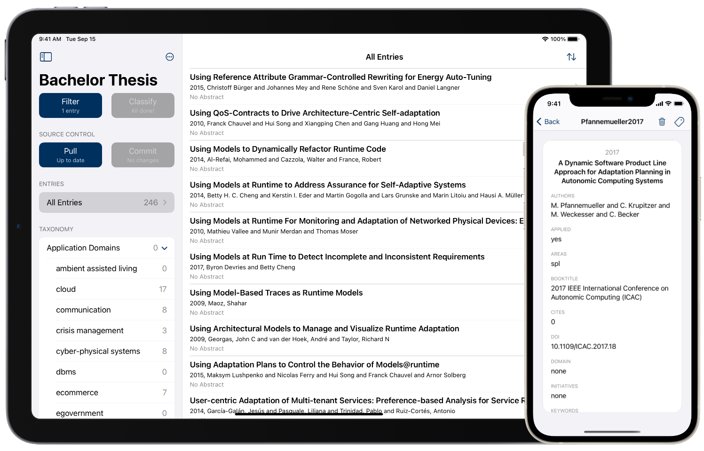

# SLR Toolkit App

The [SLR Toolkit](https://github.com/sebastiangoetz/slr-toolkit) app for iOS. Currently, the following features are available:

- Clone git repositories containing SLR Toolkit projects
- View publications (filtered by assigned taxonomy classes)
- Discard irrelevant publications
- Classify publications according to project's taxonomy
- Commit changes and push them back to origin

## Build & Run

The project can be built with Xcode 12 using Swift 5 and supports iOS 14.1 and later.  Open `SLR Toolkit.xcodeproj` and press `⌘ R`.

## Tests

This project makes use of unit tests and UI tests. They can be run in Xcode by pressing `⌘ U`.

## Architecture

The app's architecture is similar to [VIPER](https://www.objc.io/issues/13-architecture/viper/), but without presenter and router. *Views* display *entities* that are either Swift structs or [Core Data](https://developer.apple.com/documentation/coredata) objects. *Interactors* handle user interaction.

## Project Structure

The Xcode project contains the following directories:

- Views ([SwiftUI](https://developer.apple.com/xcode/swiftui/) views)
- Model (data structures that are used throughout the app)
- Logic (business logic related to project management, git, and taxonomy parsing)
- Persistence ([Core Data](https://developer.apple.com/documentation/coredata) stack and database entities)
- Other (miscellaneous constants, testing utilities, and extensions)
- Supporting Files (non-code files required for the project)

## Dependencies

This project's dependencies are managed via [SwiftPackageManager](https://swift.org/package-manager/) and [Carthage](https://github.com/Carthage/Carthage).

- [ObjectiveGit](https://github.com/libgit2/objective-git) (Git library providing bindings to libgit2)
- [SwiftyBibtex](https://github.com/MaxHaertwig/SwiftyBibtex) (Swift library for parsing BibTeX files)
